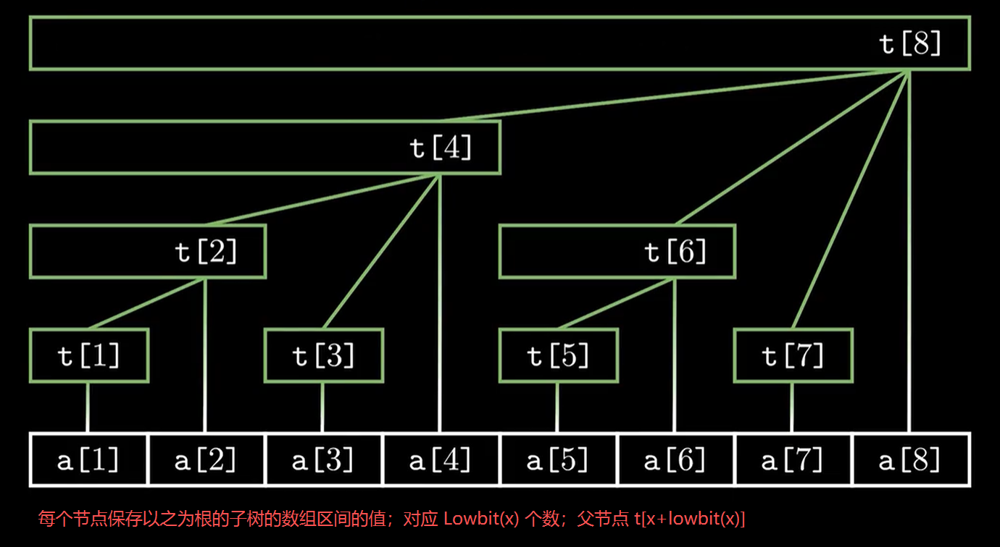

#review 
#note 



其实是基于一些巧妙的规律定义。

定义 Lowbit(x) 是 x 的二进制形式，最后一个 1 以及其后面跟着的一串 0 的那个数。
- `t[x + lowbit(x)]` 可以找到 x 的父节点之和；
- `t[x - lowbit(x)]`可以找到 x 的前面那些节点之和
- 每个节点保存以它为根的子树的节点数值之和。

```cpp
struct BIT {
    vector<ll> value;
    int n;
  
    BIT() = default;
    BIT(int _n) : value(_n + 1, 0), n(_n) {
        // 构造函数：创建一个大小为 _n+1 的数组 (因为我们使用1-based索引)
        // 并将所有值初始化为0。
    }
  
    // 单点增加操作：给差分数组的第 x 个位置增加 v
    void add(int x, ll v) {
        for (int i = x; i <= n; i += (i & -i)) {
            value[i] += v;
        }
    }
  
    /* 
    前缀和查询操作：查询差分数组从 1 到 x 的和 
	注意，是从 1 开始。如果只是需要查询片段，需要将这个叠加实现
	例如，对于 6 的查询，就是 t[6]+t[4]，后续没了，因为再减就变成 0    
    */
    ll query(int x) {
        ll ret = 0;
        for (int i = x; i > 0; i -= (i & -i)) {
            ret += value[i];
        }
        return ret;
    }
};
```


